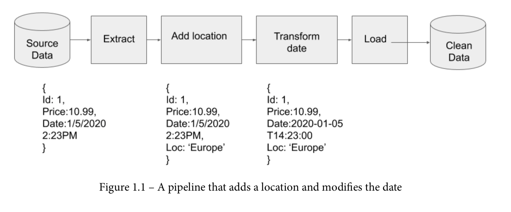
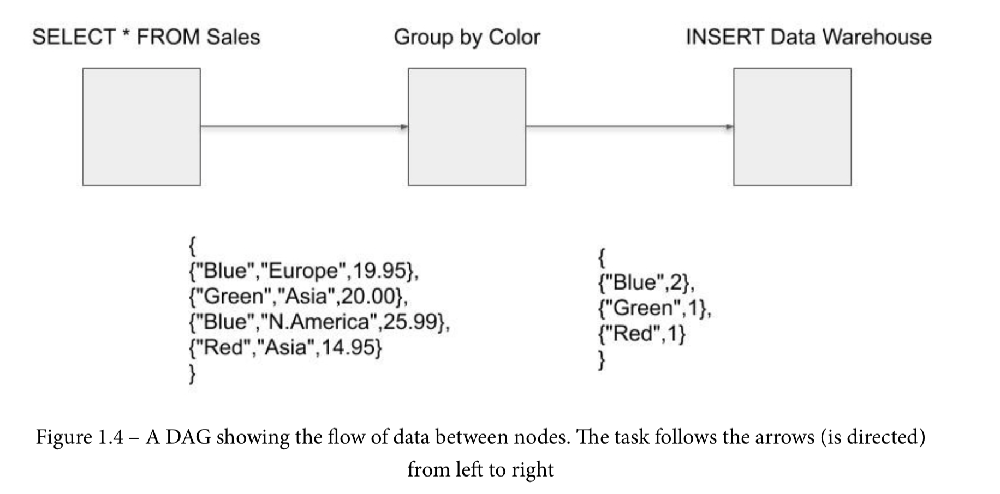
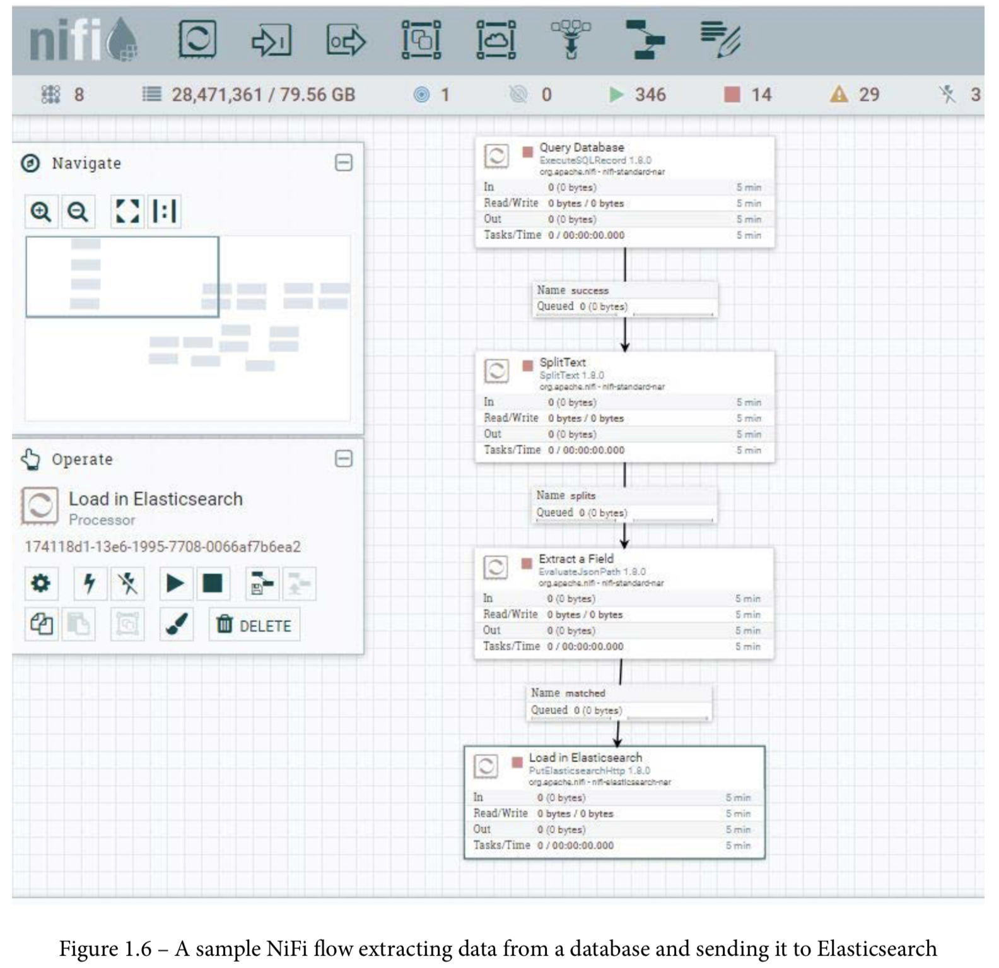

# Data_EngeneeringTuts

### Practice

An online retailer has a website where you can purchase widgets in a variety of colors. The website is backed by a relational database. Every transaction is stored in the database. How many blue widgets did the retailer sell in the last quarter?
To answer this question, you could run a SQL query on the database. This doesn't rise
to the level of needing a data engineer. But as the site grows, running queries on the production database is no longer practical. Furthermore, there may be more than one database that records transactions. There may be a database at different geographical locations – for example, the retailers in North America may have a different database than the retailers in Asia, Africa, and Europe.
Now you have entered the realm of data engineering. To answer the preceding question, a data engineer would create connections to all of the transactional databases for each region, extract the data, and load it into a data warehouse. From there, you could now count the number of all the blue widgets sold.
Rather than finding the number of blue widgets sold, companies would prefer to find the answer to the following questions:

    • How do we find out which locations sell the most widgets?
    • How do we find out the peak times for selling widgets?
    • How many users put widgets in their carts and remove them later?
    • How do we find out the combinations of widgets that are sold together?

Let's now answer the questions in the preceding list one by one:

    • Extract the data from each database.
    • Add a field to tag the location for each transaction in the data
    • Transform the date from local time to ISO 8601.
    • Load the data into the data warehouse.

The combination of extracting, loading, and transforming data is accomplished by the creation of a data pipeline. The data comes into the pipeline raw, or dirty in the sense that there may be missing data or typos in the data, which is then cleaned as it flows through the pipe. After that, it comes out the other side into a data warehouse, where it can be queried. The following diagram shows the pipeline required to accomplish the task:

### Data engineering tools
To build data pipelines, data engineers need to choose the right tools for the job. Data engineering is part of the overall big data ecosystem and has to account for the three Vs of big data:

    • Volume: The volume of data has grown substantially. Moving a thousand records from a database requires different tools and techniques than moving millions of rows or handling millions of transactions a minute.
    • Variety: Data engineers need tools that handle a variety of data formats in different locations (databases, APIs, files).
    • Velocity: The velocity of data is always increasing. Tracking the activity of millions of users on a social network or the purchases of users all over the world requires data engineers to operate often in near real time.

### Data processing engines
Data processing engines allow data engineers to transform data whether it is in batches or streams. These engines allow the parallel execution of transformation tasks. The most popular engine is Apache Spark. Apache Spark allows data engineers to write transformations in Python, Java, and Scala.

Apache Spark works with Python DataFrames, making it an ideal tool for Python programmers. Spark also has Resilient Distributed Datasets (RDDs). RDDs are an immutable and distributed collection of objects. You create them mainly by loading in an external data source. RDDs allow fast and distributed processing. The tasks in an RDD are run on different nodes within the cluster. Unlike DataFrames, they do not try to guess the schema in your data.

Other popular process engines include Apache Storm, which utilizes spouts to read
data and bolts to perform transformations. By connecting them, you build a processing pipeline. Apache Flink and Samza are more modern stream and batch processing frameworks that allow you to process unbounded streams. An unbounded stream is data that comes in with no known end – a temperature sensor, for example, is an unbounded stream. It is constantly reporting temperatures. Flink and Samza are excellent choices if you are using Apache Kafka to stream data from a system

## Data pipelines
Combining a transactional database, a programming language, a processing engine,
and a data warehouse results in a pipeline. For example, if you select all the records of widget sales from the database, run it through Spark to reduce the data to widgets and counts, then dump the result to the data warehouse, you have a pipeline. But this pipeline is not very useful if you have to execute manually every time you want it to run. Data pipelines need a scheduler to allow them to run at specified intervals. The simplest way to accomplish this is by using crontab. Schedule a cron job for your Python file and sit back and watch it run every X number of hours.

Managing all the pipelines in crontab becomes difficult fast. How do you keep track of pipelines' successes and failures? How do you know what ran and what didn't? How do you handle backpressure – if one task runs faster than the next, how do you hold data back, so it doesn't overwhelm the task? As your pipelines become more advanced, you will quickly outgrow crontab and will need a better framework.

### Apache Airflow
The most popular framework for building data engineering pipelines in Python is Apache Airflow. Airflow is a workflow management platform built by Airbnb. Airflow is made
up of a web server, a scheduler, a metastore, a queueing system, and executors. You can run Airflow as a single instance, or you can break it up into a cluster with many executor nodes – this is most likely how you would run it in production. Airflow uses Directed Acyclic Graphs (DAGs).

A DAG is Python code that specifies tasks. A graph is a series of nodes connected by a relationship or dependency. In Airflow, they are directed because they flow in a direction with each task coming after its dependency. Using the preceding example pipeline, the first node would be to execute a SQL statement grabbing all the widget sales. This node would connect downstream to another node, which would aggregate the widgets and counts. Lastly, this node would connect to the final node, which loads the data into the warehouse. The pipeline DAG would look as in the following diagram:

### Apache NiFi
Apache NiFi is another framework for building data engineering pipelines, and it too utilizes DAGs. Apache NiFi was built by the National Security Agency and is used
at several federal agencies. Apache NiFi is easier to set up and is useful for new data engineers. The GUI is excellent and while you can use Jython, Clojure, Scala, or Groovy to write processors, you can accomplish a lot with a simple configuration of existing processors. The following screenshot shows the NiFi GUI and a sample DAG:

